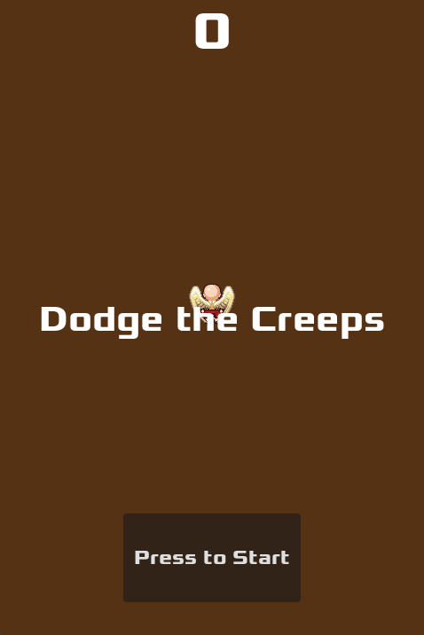

# 📌 Overview

Godot-based game project focused on implementing core game development concepts such as:

- Player movement and input handling
- Scene and node system structure
- Animation integration
- Basic gameplay mechanics
- UI and game flow design

The project serves as both a learning output and a playable prototype.

---

## ✨ Features

- 🎮 2D player movement system
- 🎬 Animation-based character control
- 🧩 Scene-based level structure
- ⚡ Lightweight and optimized gameplay loop
- 🎨 Custom sprites and game assets
- 🧠 Beginner-friendly game logic architecture

---

## 🕹️ Gameplay Overview
 

---

The player explores a simple game environment with responsive controls and animation-driven movement.

